**Casos de Prueba Historia de Usuario Asociada**

**No: 1 - Transcribir textos de español a braille**

|**test\_abecedario\_min(self)**: Verificar la conversión del abecedario completo en minúsculas su representación en Braille.|
| :- |
|**Resultado de la Prueba**|
|Al ejecutar el test se obtuvo el resultado:|
|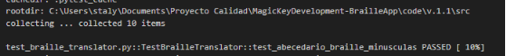|
|El resultado de la prueba muestra y verifica la traducción correcta de las letras del abecedario en minúsculas.|

|**test\_abecedario\_may(self):** Verificar la conversión del abecedario completo en mayúsculas a su representación en Braille.|
| :- |
|**Resultado de la Prueba**|
|Al ejecutar el test se obtuvo el resultado:|
|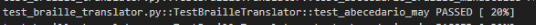|
|El resultado de la prueba muestra y verifica la traducción correcta de las letras del abecedario en mayúsculas.|

|**test\_vocales\_acentuadas(self**):Verificar la conversión de vocales acentuadas a Braille.|
| :- |
|**Resultado de la Prueba**|
|Al ejecutar el test se obtuvo el resultado:|
|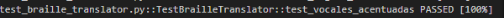|
|El resultado de la prueba muestra y verifica la traducción correcta de las vocales acentuadas.|

|**test\_letras\_especiales(self):** Verificar la conversión de letras especiales (Ñ y Ü) a Braille|
| :- |
|**Resultado de la Prueba**|
|Al ejecutar el test se obtuvo el resultado:|
|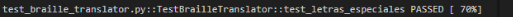|
|El resultado de la prueba muestra y verifica la traducción correcta de las letras 'ñ' y 'Ü'.|

|**test\_signos\_basicos(self):** Verificar la conversión de signos de puntuación y otros signos básicos a Braille.|
| :- |
|**Resultado de la Prueba**|
|Al ejecutar el test se obtuvo el resultado:|
|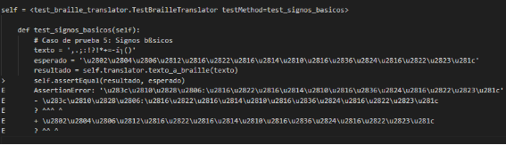|
|El resultado de la prueba muestra un error que no está funcionando los signos básicos ya que no está traduciendo correctamente el signo ‘:’y ‘¿’.|

|**test\_numeros\_una\_cifra(self):** Verificar la conversión de números de una sola cifra a Braille.|
| :- |
|**Resultado de la Prueba**|
|Al ejecutar el test se obtuvo el resultado:|
|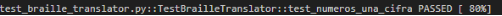|
|El resultado de la prueba muestra y verifica la traducción correcta de números de una cifra, ingresando uno por uno como '0' a '9'.|

|**test\_cantidades\_dos\_mas\_cifras(self):** Verificar la conversión de números con dos o más cifras a Braille.|
| :- |
|**Resultado de la Prueba**|
|Al ejecutar el test se obtuvo el resultado:|
|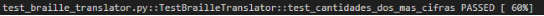|
|El resultado de la prueba muestra y verifica la traducción correcta de cantidades de dos o más cifras como 123.|

|**test\_cantidades\_con\_puntos(self):** Verificar la conversión de números con puntos a Braille.|
| :- |
|**Resultado de la Prueba**|
|Al ejecutar el test se obtuvo el resultado:|
|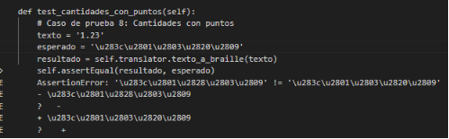|
|El resultado de la prueba muestra un error en cómo se está manejando la traducción de uno o más caracteres en la secuencia el punto decimal’.’.|

|**test\_cantidades\_con\_comas(self):** Verificar la conversión de números con comas a Braille.|
| :- |
|**Resultado de la Prueba**|
|Al ejecutar el test se obtuvo el resultado:|
|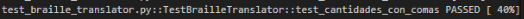|
|El resultado de la prueba muestra y verifica la traducción correcta de cantidades que incluyen comas como 1,23.|

**Casos de Prueba para Historia de Usuario 2**

**No: 2 - Transcribir textos de Braille a Español**

|**test\_abecedario\_braille\_minusculas:** Verificar que la función braille\_a\_texto convierte correctamente el Braille que representa letras minúsculas del alfabeto a texto.|
| :- |
|**Resultado de la Prueba**|
|Al ejecutar el test se obtuvo el resultado:|
|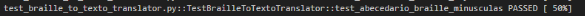|
|El resultado de la prueba muestra y verifica la traducción correcta de las letras del abecedario en minúsculas.|

|**test\_abecedario\_braille\_mayusculas:** Verificar que la función braille\_a\_texto convierte correctamente el Braille que representa letras mayúsculas del alfabeto a texto.|
| :- |
|**Resultado de la Prueba**|
|Al ejecutar el test se obtuvo el resultado:|
|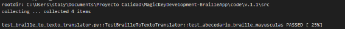|
|El resultado de la prueba muestra y verifica la traducción correcta de las letras del abecedario en mayúsculas.|

|**test\_vocales\_acentuadas\_braille:** Verificar que la función braille\_a\_texto convierte correctamente el Braille que representa vocales acentuadas a texto.|
| :- |
|**Resultado de la Prueba**|
|Al ejecutar el test se obtuvo el resultado:|
|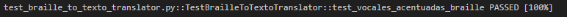|
|El resultado de la prueba muestra y verifica la traducción correcta de las vocales acentuadas.|

|**test\_signos\_basicos\_braille:** Verificar que la función braille\_a\_texto convierte correctamente el Braille que representa signos de puntuación básicos a texto.|
| :- |
|**Resultado de la Prueba**|
|Al ejecutar el test se obtuvo el resultado:|
|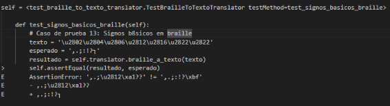|
|El resultado de la prueba muestra un error en la traducción ya que no esta convirtiendo de manera correcta el signo ‘:’y ‘┐’.|

**Casos de Prueba para Historia de Usuario 3**

**Resultado de la Prueba**

Al ejecutar el test se obtuvo el resultado:

El resultado de la prueba muestra y verifica que la señalética braille fue generada y guardada correctamente en la ubicación seleccionada.

**Casos de Prueba para Historia de Usuario 4**

**Resultado de la Prueba**

Al ejecutar el test se obtuvo el resultado:

El resultado de la prueba muestra y verifica que la imagen guardada muestra correctamente el texto en braille.

**Casos de Prueba para Historia de Usuario 5**

